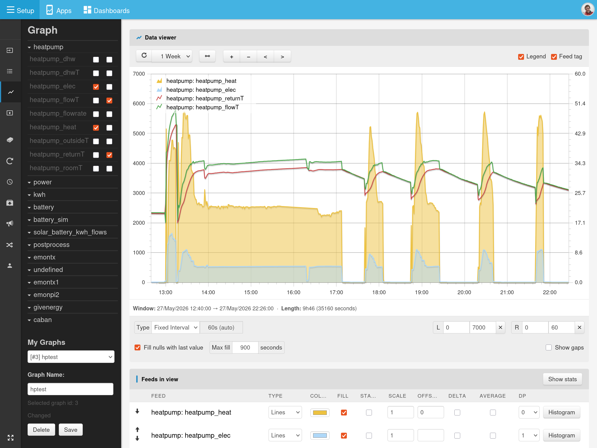

# Graph Module

The Graph module provides Emoncms' main feed visualisation and comparison interface. It lets you open one or more feeds, explore a selected time window, and adjust how each series is displayed without leaving the page.

## Key features

- Multi-feed graphing with line, bar, point, and step display modes.
- Quick time navigation with preset ranges, manual start/end selection, zoom, and pan controls.
- Dual-axis support so feeds with different units or scales can be viewed together.
- Per-feed display options including colour, fill, stacking, scale, offset, delta, averaging, and decimal precision.
- Toggleable legend and optional feed tag display for clearer comparisons.
- Gap handling options including showing missing data or filling short null gaps with the last value.
- Feed statistics and CSV output for exporting or inspecting the current graph window.
- Saved graph support for reusing common feed combinations and layouts.
- Histogram view for analysing time at value or kWh at power.

## Interface overview

The main graph area shows the selected feeds for the current time window. Controls above the chart handle refresh, time selection, zooming, and navigation. Below the chart, the options panel lets you change interval mode, axis limits, and gap handling, while the feeds table provides detailed per-series settings and summary statistics.

An embedded version of the graph view is also available for use in dashboards.
